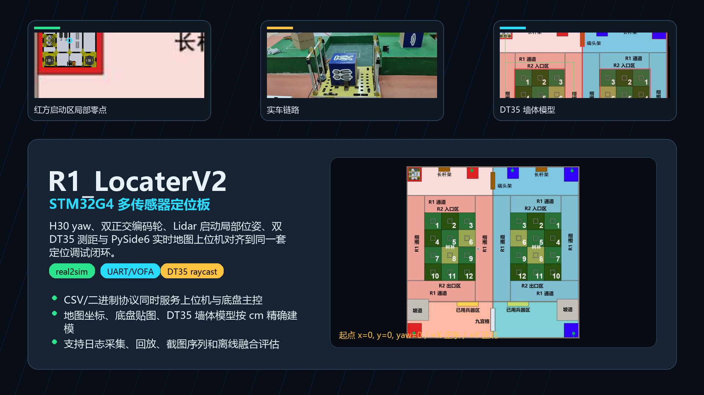

# R1_LocaterV2

R1_LocaterV2 是基于 STM32G4 的 R1 机器人定位板工程。它把 H30 MINI 惯导、双正交编码轮、Lidar 位姿、双 DT35 测距和 Windows 上位机调试工具统一到一套定位闭环中，用于比赛场地中的实时定位、传感器排障、数据采集和 real2sim 算法迭代。

<p align="center">
  <a href="https://lwbscu.github.io/R1_LocaterV2/">
    
  </a>
</p>

<p align="center">
  <a href="https://github.com/lwbscu/R1_LocaterV2"></a>
  <a href="https://lwbscu.github.io/R1_LocaterV2/"></a>
  <a href="https://juejin.cn/spost/7654479136493420554"></a>
  <a href="https://lwbscu.github.io/R1_LocaterV2/promo-video.html"></a>
  <a href="docs/promotion/r1-locaterv2-demo.mp4"></a>
  
  
</p>

## What's NEW!

- [2026/06] 🔥 完成 R1_LocaterV2 定位板重构：STM32G4 固件、PySide6 上位机、日志采集和回放闭环统一到同一套工程。
- [2026/06] 🔥 打通 H30 yaw、双正交编码轮、Lidar 位姿、双 DT35 测距与场地墙体模型，用启动局部零点对齐底盘主控输出。
- [2026/06] 🔥 初步实车全程 yaw 累计误差约 `0.04 deg`，并建立 real2sim / RLHF 数据采集与离线评估链路。

## 当前状态

- 码盘定位板已迭代到 V2，主控芯片为 STM32G4。
- 初步实车跑全程 yaw 累计误差约 `0.04 deg`。
- 已集成 H30 yaw、双正交编码轮、Lidar 数据、双 DT35 测距和 PySide6 实时地图上位机。
- 当前调试重点是：以 Lidar 启动坐标为局部零点，用 H30 yaw 和编码轮做高频插值，用 DT35 与场地墙体模型做位置约束和异常筛选。

## 坐标约定

比赛调试阶段采用“红方启动区局部坐标”作为主要输出语义：

- 机器人放在红方左上启动区几何中心并上电时，`x=0, y=0, yaw=0`。
- 地图正东为 `+X`，地图正北为 `+Y`。
- 车向右移动时 `x` 增大，向下移动时 `y` 减小。
- Lidar 输出是启动姿态下的相对位姿，不再把场地中心强行设为 `(0,0)`。
- 上位机可同时显示地图绝对坐标，用于检查贴图、墙体、DT35 命中和回放对齐。

## 硬件链路

| 模块 | 外设 | 作用 |
| --- | --- | --- |
| 调试上位机 | USART1 `115200` | 输出轻量定位 CSV，支持无线串口实时地图 |
| 底盘主控 | USART2 `1152000` | 输出 `PG + 11 float + checksum` 二进制帧 |
| Lidar | USART3 `115200` | 接收雷达定位数据 |
| H30 MINI | UART4 `460800` | 接收 yaw / 姿态数据 |
| DT35-1 / DT35-2 | UART5 `115200` | 轮询两个 DT35 距离，ID1 左发左射，ID2 右发右射 |
| 正交编码轮 1/2 | TIM2 / TIM3 Encoder | 获取本地位移增量 |

## 通信协议

### USART1: `r1_csv_v3`

默认输出 12 列纯数字 CSV，供上位机、日志采集和回放工具解析：

```text
pos_x,pos_y,pos_yaw,lidar_x,lidar_y,lidar_yaw,encoder_x,encoder_y,h30_yaw,dt35_1_mm,dt35_2_mm,status_mask
```

字段单位：

- `x/y`: cm
- `yaw`: deg
- `dt35`: mm
- `status_mask`: bit mask，包含编码轮、H30、Lidar、DT35、错误状态等。

### USART2: 底盘主控帧

当前底盘主控接收 11 个 float：

```text
'P','G',
x,y,yaw,
lidar_x,lidar_y,lidar_yaw,
encoder_x,encoder_y,
h30_yaw,
dt35_1,dt35_2,
checksum
```

`checksum` 为前面所有字节的 uint8 累加和。

## 上位机

上位机位于 [`locater_map/`](locater_map/)，使用 PySide6 + pyserial 实现，不依赖 ROS、Foxglove、RViz、Web 或 Electron。

主要能力：

- 实时串口接收和 raw 串口助手。
- 场地地图、机器人贴图、轨迹、DT35 射线、墙体模型显示。
- 采集 `raw_serial.log`、结构化 CSV 和同步地图 PNG。
- 支持日志回放、截图、实车数据分析和离线 real2sim 仿真。
- DT35 raycast 使用理想场地图，实车缺墙、地面不平、人/机器人遮挡会被作为低置信度或异常观测处理。

安装与运行：

```powershell
cd R1_LocaterV2\locater_map
python -m venv .venv
.venv\Scripts\activate
pip install -r requirements.txt

python main.py --demo
python main.py --serial-port COM9 --baudrate 115200
```

采集数据：

```powershell
python main.py --serial-port COM9 --baudrate 115200
```

在 GUI 中点击“开始采集数据”，移动机器人，再次点击保存。采集结果默认进入：

```text
locater_map/logs/RL_data/YYYYMMDD_HHMMSS_log/
```

目录中包含传感器 CSV、raw 串口日志、事件日志、地图 PNG 序列和 metadata。

## real2sim 与 DT35 建模

DT35 的核心问题不是单次距离读数，而是“这束光到底打到了哪一面墙”。R1_LocaterV2 在上位机中建立了比赛场地墙体模型：

- 红色墙体：可用于定位约束。
- 蓝色虚线区域：长杆架、空隙等强干扰区域，只用于避开，不参与修正。
- 绿色区域：坡道、梅林等特殊障碍，会挡光，但修正权重低于规则墙体。

算法流程：

1. Lidar 给出启动局部坐标下的绝对锚点。
2. H30 yaw 作为高频姿态参考。
3. 编码轮提供两帧 Lidar 之间的高频位移插值。
4. DT35 结合 yaw 和墙体模型进行 raycast，筛选命中目标和置信度。
5. 上位机用实车日志回放与仿真路径对比，定位墙体模型、DT35 安装 offset、编码轮比例和场地缺失导致的误差来源。

当前离线仿真基准下，融合模型可将代表路径平均 XY RMS 从约 `5.64 cm` 降到约 `1.97 cm`；混合场地巡航路径从约 `11.74 cm` 降到约 `7.36 cm`。这些是离线基准结果，最终比赛场地仍需用实车日志复核。

## 目录结构

```text
Core/Application/        STM32 应用层：定位、遥测、DT35/H30/Lidar/编码轮调度
Core/Src/                STM32Cube 生成与外设初始化代码
locater_map/             Windows 上位机、地图模型、日志采集与回放工具
locater_map/assets/      场地图、底盘贴图、实车视频等资源
docs/promotion/          README 封面、演示视频、GitHub Pages 展示页和生成脚本
```

## 致谢

- 技术总负责：[@lwbscu](https://github.com/lwbscu)
- 电控技术支持：[@Thomaswang2005](https://github.com/Thomaswang2005)、[@HIRAMHC111](https://github.com/HIRAMHC111)
- lidar 技术支持：[@Getting05](https://github.com/Getting05)、[@qyw23AI](https://github.com/qyw23AI)
- 硬件芯片设计：[@twenty-fourabc](https://github.com/twenty-fourabc)、[@2718487561-a11y](https://github.com/2718487561-a11y)、[@wancyu](https://github.com/wancyu)
- 机械结构设计：马克（GitHub 用户名待定）
