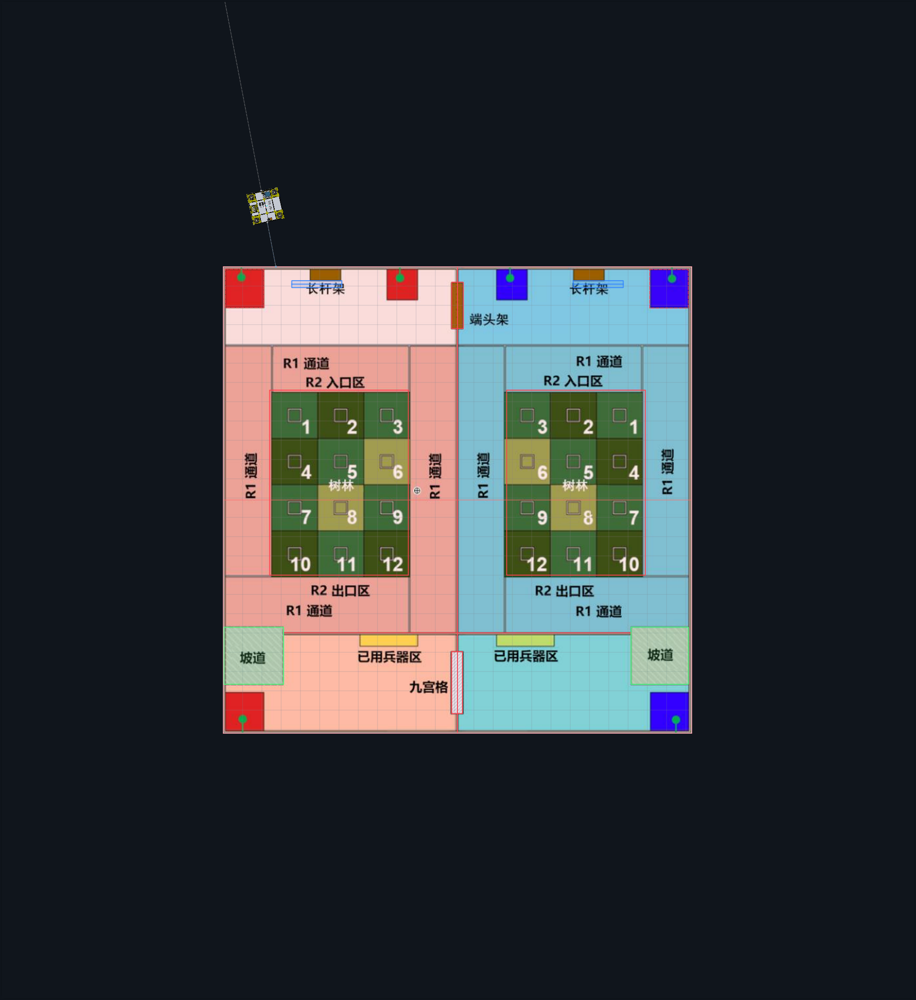
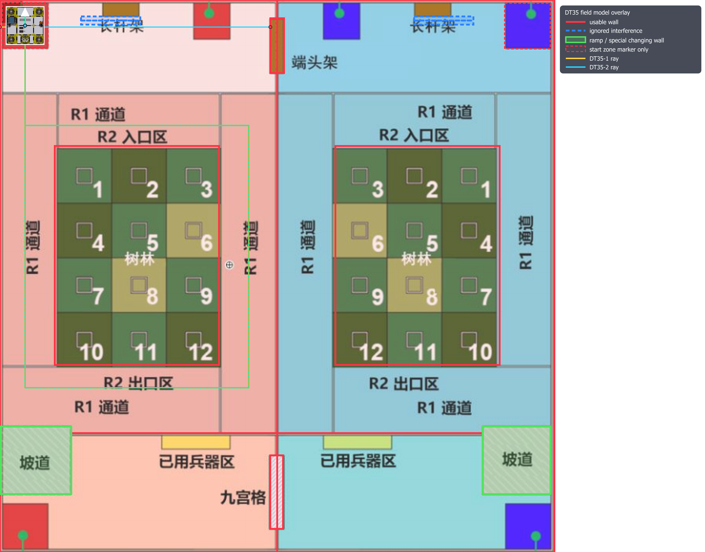

# 我们把 R1 机器人定位板重构成了一套 real2sim 调试闭环：STM32G4 + H30 + 编码轮 + Lidar + 双 DT35

> 建议标签：机器人、STM32、PySide6、传感器融合、嵌入式  
> 项目地址：https://github.com/lwbscu/R1_LocaterV2


R1_LocaterV2 是我们为 R1 机器人重新做的一版定位板工程。硬件主控基于 STM32G4，传感器包括 H30 MINI 惯导、双正交编码轮、Lidar、双 DT35 测距。PC 侧写了一个 PySide6 上位机，负责实时地图显示、串口调试、日志采集、离线回放和 DT35 墙体模型仿真。

这个项目的目标不是单纯“把几个传感器读出来”，而是把定位调试做成闭环：

- 车上实时输出传感器和融合状态。
- 上位机按真实场地尺寸显示机器人、轨迹和 DT35 射线。
- 实车数据按时间帧保存为 CSV + 截图。
- 离线用理想场地图做 raycast，筛选 DT35 的可信命中。
- 再把仿真结论回到实车参数、地图边界和融合策略里。

## 为什么需要重构

原来定位板的代码和底盘工程耦合较重，旧任务、旧外设和调试输出混在一起。做新一版时我们把目标明确成三件事：

1. 定位板自身可独立调试。
2. 和底盘主控的协议稳定。
3. 后续算法优化可以靠日志回放，而不是每次都推车上场。

于是固件侧清成了定位任务 + 遥测任务 + 传感器驱动；PC 侧做成独立上位机，不依赖 ROS、Foxglove、RViz 或 Web。

## 当前硬件与协议

固件串口分配如下：

| 接口 | 波特率 | 用途 |
| --- | ---: | --- |
| USART1 | 115200 | 轻量定位 CSV / PySide6 实时地图 |
| USART2 | 1152000 | 发送给底盘主控 |
| USART3 | 115200 | 接收 Lidar 数据 |
| UART4 | 460800 | 接收 H30 MINI IMU |
| UART5 | 115200 | 轮询两个 DT35 |

USART1 默认输出 12 列 `r1_csv_v3`：

```text
pos_x,pos_y,pos_yaw,lidar_x,lidar_y,lidar_yaw,encoder_x,encoder_y,h30_yaw,dt35_1_mm,dt35_2_mm,status_mask
```

它能被上位机直接解析，也便于记录和回放定位数据。USART2 给底盘主控输出 `PG + 11 float + checksum`，包含最终定位、Lidar、编码轮、H30 yaw 和两个 DT35 距离。

## 坐标系：不要把场地中心误当成机器人零点

调试中最容易出错的是坐标原点。

当前语义是：机器人放在红方左上启动区几何中心并上电时，`x=0, y=0, yaw=0`。地图正东为 `+X`，正北为 `+Y`。也就是说，车往右走 `x` 增大，车往下走 `y` 减小。

Lidar 的 `0,0,0` 是启动姿态下的局部零点，不是场地中心。上位机仍能显示地图绝对坐标，但主控和调试主要看启动区局部坐标。

这个约定很关键，因为底盘控制、Lidar 输出、DT35 反推位置必须说同一种坐标语言。

## 上位机：高级串口助手 + 实时地图

上位机位于 `locater_map/`，技术栈是 PySide6 + pyserial。它做了这些事情：

- 选择串口、打开/关闭串口、显示 RX bytes/s 和 FPS。
- 显示机器人底盘贴图，尺寸固定为 83 cm x 83 cm。
- 绘制最终轨迹、编码轮轨迹、Lidar 轨迹。
- 绘制 DT35 射线和命中点。
- 显示传感器状态：正交编码轮 1/2、H30、Lidar、DT35-1/2。
- 支持采集日志、回放日志、保存截图序列。



采集数据时，上位机会生成：

```text
locater_map/logs/RL_data/YYYYMMDD_HHMMSS_log/
  sensor_data/
    raw_serial.log
    raw_frames.csv
    display_frames.csv
    events.log
  png/
    frame_*.png
  metadata.json
```

这样每一帧传感器数据都能和地图截图对齐，用于复盘和离线建模。

## DT35 难点：不是测距，而是判断打到了哪里

两个 DT35 安装在机器人左右两侧：

- DT35-1：`(+40.4 cm, -3.3 cm)`，向机器人局部 `-X` 发射。
- DT35-2：`(-40.4 cm, -3.3 cm)`，向机器人局部 `+X` 发射。

机器人旋转后，DT35 射线也会跟着旋转，所以必须结合 H30 yaw 把局部射线变换到世界坐标，再和场地墙体模型求交。

我们把场地模型分成几类：

- `usable_wall`：规则墙体，可用于修正位置。
- `solid_obstacle`：梅林、坡道等实心障碍，会挡光，但修正权重较低。
- `ignore`：长杆架等强干扰区域，有空隙和不稳定反射，不参与修正。
- `blocker`：只挡光，不作为可信定位面。

这样实车中出现“人走过挡住 DT35”“R2 协作机器人挡住 DT35”“实际练习场缺少某些墙体”时，算法不会盲目把单次距离当成可靠定位约束。

## real2sim 的工作方式

当前融合链路可以概括为：

1. Lidar 给绝对锚点。
2. H30 yaw 作为高频姿态参考。
3. 编码轮负责两帧 Lidar 之间的高频位移。
4. DT35 用墙体模型验证侧向距离。
5. 上位机通过回放比较 raw pose、no-DT35 pose 和 DT35 fused pose。



离线基准中，代表路径平均 XY RMS 从约 `5.64 cm` 降到约 `1.97 cm`；混合场地巡航路径从约 `11.74 cm` 降到约 `7.36 cm`。这个数字不是最终比赛场地证明，但它说明当前模型已经能把 Lidar、H30、编码轮和 DT35 放到同一个可验证框架里。

## 视频与剪映工程

项目里放了一个 50 秒左右的演示视频：

- `docs/promotion/r1-locaterv2-demo.mp4`
- `docs/promotion/r1-locaterv2-demo-teaser.gif`
- `locater_map/assets/实车.mp4`

还提供了可复现的剪映草稿脚本：

```powershell
cd R1_LocaterV2
$env:JY_SKILL_ROOT='C:\Users\神之庇护\.codex\skills\jianying-editor'
& "$env:JY_SKILL_ROOT\.venv\Scripts\python.exe" docs\promotion\jianying\create_r1_locaterv2_promo.py
```

剪映草稿名为 `R1_LocaterV2_Promo`，包含封面、融合链路、实车视频、仿真回放和字幕轨。

## 后续计划

- 在标准比赛场地重新采集完整日志。
- 用 DT35 残差反推左右传感器 offset 和部分墙体模型误差。
- 把实车缺墙、坡道地面反射、人/机器人遮挡统一进置信度模型。
- 继续压缩底盘主控协议和状态位，保证比赛时链路稳定。

## 致谢

感谢李彦彦、王晨宇、李岳林、马克在硬件调试、传感器接入、定位算法和工程验证中的技术支持。
